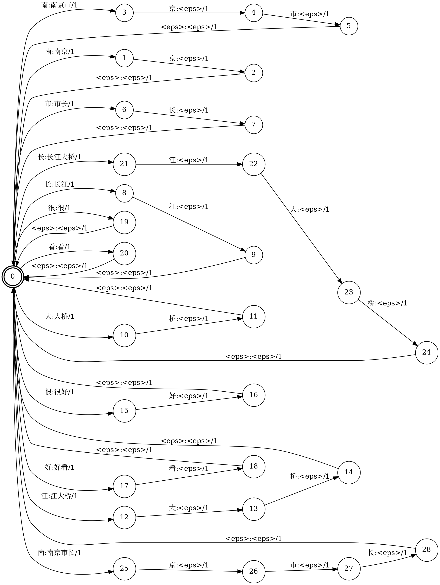
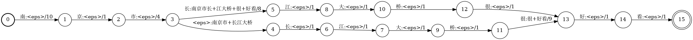

# openfst_practices
Some practices of learning Openfst

These are some practices of learning Openfst, which include converting digits to alphabet and chinese tokenization.

## Digits to Alphabet

This module converts a number to alphabet

Example: converting `10011` to `ten thousands eleven`


## Simple_okenizer

The `simple_tokenizer` only tokenizes a sentence with a fixed small token table and presents all possible paths.

The graph of Tokenization fst:


All paths:



## Tokenizer

The `tokenizer` provides a functionality that powerful than `simple_tokenizer`. The `tokenizer` can tokenizes senetens by any given token table and generate the N-best result by using greedy search

```console
(base) lqb$ ./tokenization 南京市长江大桥真好看
(base) lqb$ ./iterarc
南京市 长江 大 桥 真 好看 
南京 市长 江 大 桥 真 好看 
南京 市 长江 大 桥 真 好看 
南京市 长 江 大 桥 真 好看 
南京市 长江 大 桥 真 好 看 
```
